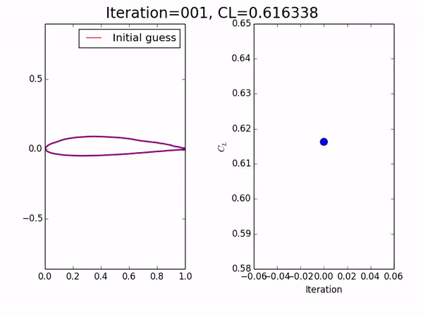
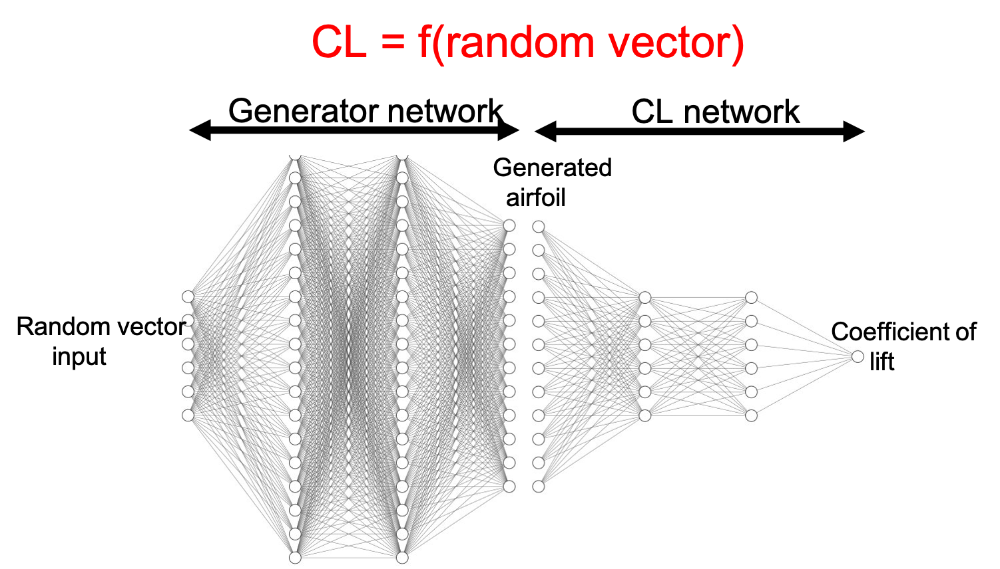

# Using DCGAN for airfoil shape optimization 

[Click here to download the presentation of this work](https://www.dropbox.com/scl/fi/cqm5mbc9h2pyxvbqnsq2i/DCGANAirfoilOptimization.pptx?dl=0&rlkey=h43ujaya819euvmjsdx56fk5z)

## GAN training to generate airfoils from a random vector input and the steepest descent optimization process



## Introduction

This repository contains the Python scripts required for the machine learning based shape optimization for two-dimensional airfoils 
using Deep Convolutional Generative Adversarial Networks (DCGAN) to optimize the coefficient of lift. Note that this required 
high-resolution training data from computational fluid dynamics simulations of airfoils at high-speed flows. The training data consisted 
to steady-state flow fields for a Mach 0.65 flow over 900 NACA 4-digit airfoils which have polynomial representations for the shape. 

## Methodology

Two different neural networks are trained  
 
(a) The first network maps the smooth airfoil shape to the coefficient of lift using the simulation training data  
(b) The second network - a DCGAN which takes a random vector as the input and outputs a smooth airfoil (much similar to how Deepfake works to create new faces)

The two neural networks are then combined to get a single network that maps the random vector to the coefficient of lift. Once we have a functional relation, a 
steepest gradient descent methodology is utilized to perform the optimization. During 
the iterations, at each step, the input random vector is updated, and passed through the trained generator network to obtain a 
smooth airfoil, and that is passed through the network in (a) to obtain the coefficient of lift. 



The steps for the training and shape optimization procedure are below

1. ```
   cd NACA_4digitGenerator    
   sh run NACA_4digitGenerator.py
	```

   Generate NACA 4 digit airfoils - these are the airfoils for the simulations and computing the coefficient of lift. Code is in the directory CNS_EBoft_AirfoilOptimization 

2. ``` 
   cd ComputeCL    
   python ComputeCL.py    
   python ComputeMaxCL.py
   ```

   Get all the CL*txt files from the solver directory and compute CL, also the max CL    

3. ```
   sh run_GAN_NACA_Airfoils.sh
   ```
   From the NACA airfoils use the DCGAN to generate new airfoils    

4. ``` 
   python CLLearning_NACA_Airfoils.py
   ```
   Train a neural network that learns `f(shape) = CL` for the NACA airfoils using simulation data. Save the checkpoint file for this. This is the CLLearner.    

4. ```
   sh run_GenerateNewAirfoils.sh
   ```
   Create new airfoils

5. ```
   python CLPrediction_NewAirfoils.py
   ```

   Now use the CLLearner to compute the predicted values of CL for the newly generated airfoils. Save the output into CL_new_airfoils.txt   

6. ``` 
	python CLNoiseLearing_New_Airfoils.py
   ```

   Now train a neural network for f(noiseinput) = CL. Use this for optimization over the input random noise vefctor.   

7. ``` 
	python CLOptimization.py
   ```	

   Perform optimization   

8. ```
   cd CorrectedAirfoils   
   python CorrectedAirfoils.py
   ```

   Manually close the airfoils. Choose the index of the airfoil from the optimization. Copy the corrected  airfoil data to the solver running directory and try. 
There might be errors of multiple cuts or the weird intersection at trailing edges. Do the simulation and compute CL. Code is in the directory CNS_EBoft_OptimalAirfoil  

9. ```
   cd OptimalAirfoil    
   python ComputeCLOptimal.py
   ```
   
   Compute the CL for the optimal airfoil. It also plots all the training data CL values as well.   

10. ```
    python CLOptimization_Optimal.py
	``` 
 
    Plot the optimization history for the optimal airfoil. You have to choose the optimal airfoil number in optimal_no.   

